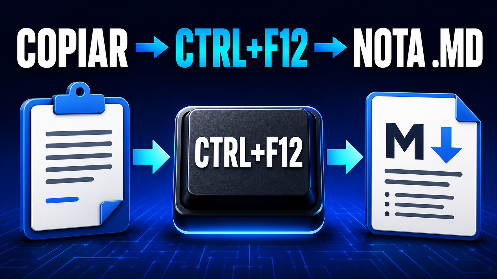

# Portapapeles a Markdown en Windows

Copia cualquier fragmento de texto, pulsa una combinación de teclas y guárdalo automáticamente como un archivo Markdown dentro de un `inbox`.

## Vídeo paso a paso

[](https://youtu.be/Id3ZUSKpzq8)

[▶ Ver el tutorial completo en YouTube](https://youtu.be/Id3ZUSKpzq8)

El script:

- Lee el texto del portapapeles.
- Utiliza la primera línea para generar el nombre del archivo.
- Añade fecha y hora para evitar nombres repetidos.
- Guarda el contenido sin abrir Obsidian ni solicitar un título.
- Solo muestra una ventana si ocurre un error.

## Requisitos

- Windows 10 u 11.
- Windows PowerShell 5.1, incluido en Windows.
- Una carpeta existente donde guardar las notas.

No es necesario instalar módulos adicionales.

## 1. Preparar las carpetas

Crea una carpeta para guardar el script. Por ejemplo:

```text
C:\Users\TU_USUARIO\Documents\Herramienta_IA
```

Elige también la carpeta donde se guardarán las notas. Por ejemplo:

```text
C:\Users\TU_USUARIO\Documents\MiVault\inbox
```

La carpeta de destino debe existir antes de ejecutar el script.

## 2. Mostrar las extensiones de archivo

En el Explorador de archivos:

1. Abre **Ver**.
2. Selecciona **Mostrar**.
3. Activa **Extensiones de nombre de archivo**.

Esto evita guardar accidentalmente el script como `Crear-Nota-Portapapeles.ps1.txt`.

## 3. Crear el script

Abre el Bloc de notas y pega el siguiente código:

```powershell
Add-Type -AssemblyName System.Windows.Forms

try {
    $inbox = "PEGA_AQUI_LA_RUTA_DE_TU_INBOX"

    if (-not (Test-Path -LiteralPath $inbox)) {
        throw "No existe la carpeta: $inbox"
    }

    $texto = Get-Clipboard -Raw

    if ([string]::IsNullOrWhiteSpace($texto)) {
        throw "El portapapeles no contiene texto."
    }

    $primeraLinea = $texto -split "\r?\n" |
        Where-Object { -not [string]::IsNullOrWhiteSpace($_) } |
        Select-Object -First 1

    $titulo = $primeraLinea.Trim()
    $titulo = $titulo -replace '^[\s#>*+-]+', ''

    if ($titulo -match '^https?://\S+$') {
        $direccion = [Uri]$titulo
        $titulo = $direccion.Host + $direccion.AbsolutePath
        $titulo = $titulo -replace '^www\.', ''
        $titulo = $titulo.TrimEnd('/')
    }

    $titulo = $titulo -replace '[<>:"/\\|?*]', ' '
    $titulo = $titulo -replace '[^\p{L}\p{Nd}\s_-]', ''
    $titulo = $titulo -replace '[_\s]+', '-'
    $titulo = $titulo -replace '-+', '-'
    $titulo = $titulo.Trim('-').ToLowerInvariant()

    if ([string]::IsNullOrWhiteSpace($titulo)) {
        $titulo = "nota"
    }

    if ($titulo.Length -gt 70) {
        $titulo = $titulo.Substring(0, 70).TrimEnd('-')
    }

    $fecha = Get-Date -Format "yyyy-MM-dd-HHmmss"
    $archivo = Join-Path $inbox "$fecha-$titulo.md"

    Set-Content -LiteralPath $archivo -Value $texto -Encoding UTF8
}
catch {
    [System.Windows.Forms.MessageBox]::Show(
        $_.Exception.Message,
        "Error al crear la nota"
    ) | Out-Null
}
```

Sustituye esta línea:

```powershell
$inbox = "PEGA_AQUI_LA_RUTA_DE_TU_INBOX"
```

por la ruta real de tu `inbox`:

```powershell
$inbox = "C:\Users\TU_USUARIO\Documents\MiVault\inbox"
```

Mantén las comillas.

## 4. Guardar el script

En el Bloc de notas:

1. Selecciona **Archivo > Guardar como**.
2. En **Tipo**, elige **Todos los archivos**.
3. Escribe `Crear-Nota-Portapapeles.ps1`.
4. Guárdalo dentro de la carpeta `Herramienta_IA`.

Comprueba que el archivo termina exactamente en `.ps1`, no en `.ps1.txt`.

## 5. Probar el script

1. Copia un fragmento de texto.
2. Abre la carpeta `Herramienta_IA`.
3. Haz clic derecho en una zona vacía.
4. Selecciona **Abrir en Terminal**.
5. Ejecuta:

```powershell
powershell.exe -NoProfile -ExecutionPolicy Bypass -File ".\Crear-Nota-Portapapeles.ps1"
```

Comprueba que se haya creado un archivo `.md` dentro del `inbox`.

Si PowerShell indica que el script no existe, muestra los nombres reales de los archivos con:

```powershell
Get-ChildItem -File | Select-Object -ExpandProperty Name
```

No continúes hasta que la ejecución manual funcione.

## 6. Crear el acceso directo

1. Haz clic derecho en una zona vacía del escritorio.
2. Selecciona **Nuevo > Acceso directo**.
3. Introduce este destino, sustituyendo la ruta del script:

```text
C:\Windows\System32\WindowsPowerShell\v1.0\powershell.exe -NoProfile -ExecutionPolicy Bypass -WindowStyle Hidden -File "C:\RUTA\HASTA\Crear-Nota-Portapapeles.ps1"
```

Ejemplo:

```text
C:\Windows\System32\WindowsPowerShell\v1.0\powershell.exe -NoProfile -ExecutionPolicy Bypass -WindowStyle Hidden -File "C:\Users\TU_USUARIO\Documents\Herramienta_IA\Crear-Nota-Portapapeles.ps1"
```

4. Pulsa **Siguiente**.
5. Ponle el nombre `Crear nota desde el portapapeles`.
6. Pulsa **Finalizar**.

En las propiedades del acceso directo:

- **Destino** debe contener PowerShell, sus parámetros y el script.
- **Iniciar en** debe estar vacío o contener solamente la carpeta donde está el script.

## 7. Probar el acceso directo

1. Copia un fragmento de texto.
2. Haz doble clic en el acceso directo.
3. Comprueba que se haya creado el Markdown.

No configures el atajo de teclado hasta que el acceso funcione haciendo doble clic.

## 8. Asignar una combinación de teclas

1. Haz clic derecho sobre el acceso directo.
2. Selecciona **Propiedades**.
3. Abre la pestaña **Acceso directo**.
4. Haz clic en **Tecla de método abreviado**.
5. Pulsa `Ctrl + F12`.
6. Pulsa **Aplicar > Aceptar**.

El acceso directo debe permanecer en el escritorio o dentro del menú Inicio para que Windows mantenga la combinación.

Se recomienda evitar combinaciones como `Ctrl + Alt + Q` en teclados españoles, porque pueden entrar en conflicto con `AltGr`.

## Uso

```text
Copiar texto -> Ctrl + F12 -> nota Markdown guardada
```

Si copias:

```text
La memoria de un agente no debería depender de la conversación.
```

se generará un archivo similar a:

```text
2026-08-27-153045-la-memoria-de-un-agente-no-debería-depender-de-la-conversación.md
```

El contenido del archivo será exactamente el texto copiado.

## Solución de problemas

### PowerShell se abre y se cierra

Comprueba primero que el nombre incluido en el acceso directo coincide exactamente con el nombre real del script.

### Se abre una carpeta al pulsar la combinación

Existe otro acceso directo que tiene asignada la misma tecla. Elimina esa asignación desde **Propiedades > Tecla de método abreviado** o utiliza otra combinación.

### No aparece ningún archivo

Ejecuta el script manualmente desde la terminal para ver el error:

```powershell
powershell.exe -NoProfile -ExecutionPolicy Bypass -File ".\Crear-Nota-Portapapeles.ps1"
```

### El script aparece como archivo de texto

Activa las extensiones de archivo y comprueba que el nombre no termina en `.ps1.txt`.

### La carpeta no existe

Revisa la ruta configurada en `$inbox`. Debe ser una ruta absoluta y apuntar a una carpeta existente.

## Seguridad

El acceso utiliza `-ExecutionPolicy Bypass` únicamente para ese proceso de PowerShell. No modifica de forma permanente la política de ejecución del sistema.

El script solo lee texto del portapapeles y escribe un archivo dentro de la carpeta configurada.
